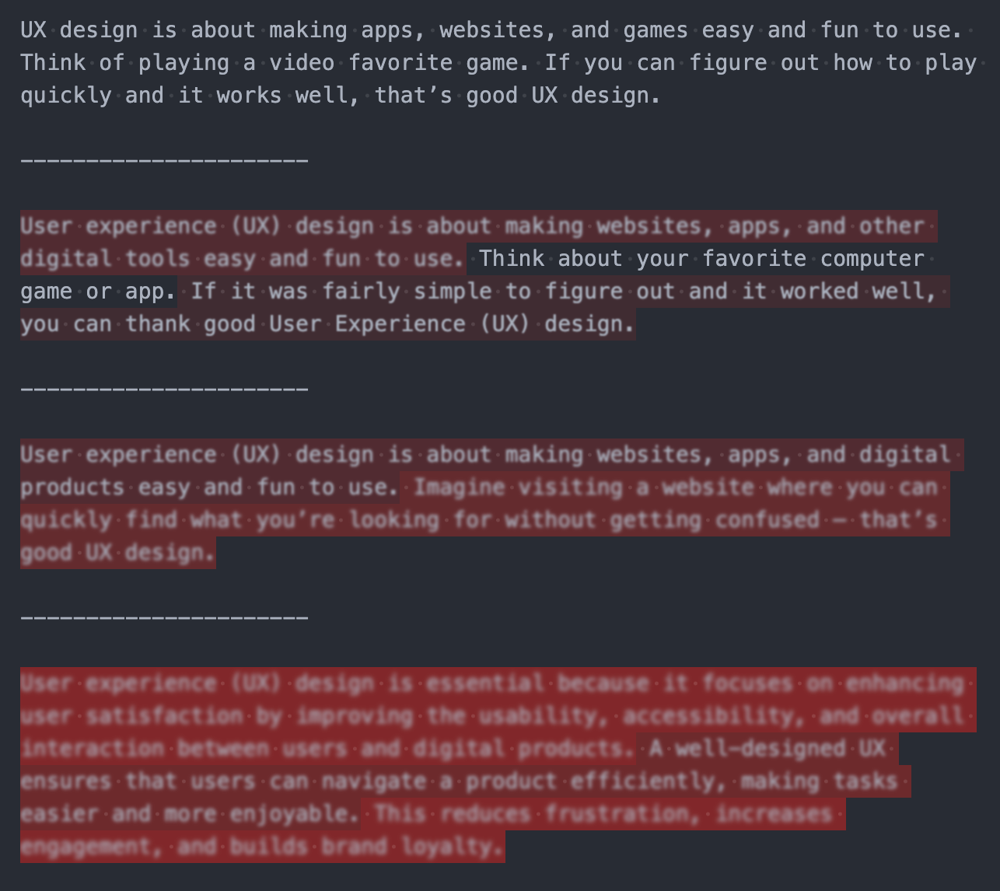

# The english-kiss (VS Code Extension)

This extension helps you simplify your writing (English), by highlighting places where you got a little "too fancy" with your words. It's not anything like a french kiss.

## WARNING

This is just a prototype. Don't actually use it 😜

## Keep it Simple, Silly

This extensions makes complicated sentences difficult to read (literally).

## Next Steps

* Quick Toggle: Make it easy to toggle this feature on and off -- from status bar?
* Discoverability: Link in hover text to get details and (AI) suggestions to fix.
* Customization: Let the user adjust the appearance of the highlight.
* Accessibility: Screen readers, color blindness, etc.
* Performance: Only reevaluate the parts of the document that changed.
* File Formats: Support other types of documents (e.g. markdown, comments in code, etc.)

